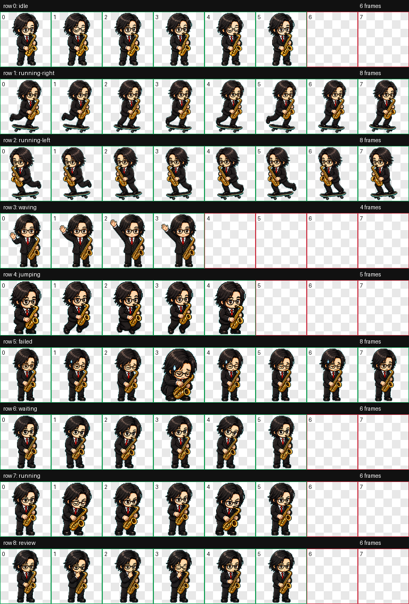

# HJ Codex Pet

English | [简体中文](README.zh-CN.md)


HJ is a pixel-art Codex desktop pet with black hair, glasses, a black suit, a red tie, a tiny golden saxophone, and skateboard energy.

## Preview



## Files

- `pet.json` - Codex pet manifest.
- `spritesheet.webp` - animated pet spritesheet.
- `assets/` - README preview images.

## Install

Copy `pet.json` and `spritesheet.webp` into your local Codex pets folder:

```powershell
New-Item -ItemType Directory -Force "$env:USERPROFILE\.codex\pets\hj"
Copy-Item .\pet.json, .\spritesheet.webp "$env:USERPROFILE\.codex\pets\hj" -Force
```

Then restart Codex and choose `HJ` from the pets list.

## Animation States

- `idle` - normal resting state.
- `running-right` - moving or being dragged to the right.
- `running-left` - moving or being dragged to the left.
- `waving` - wake or attention state.
- `jumping` - lively feedback state.
- `failed` - failed, cancelled, or blocked state.
- `waiting` - waiting for user input.
- `running` - Codex is working.
- `review` - work is ready to review.

## Notes

Codex custom pets currently support image animation through `pet.json` and `spritesheet.webp`.
